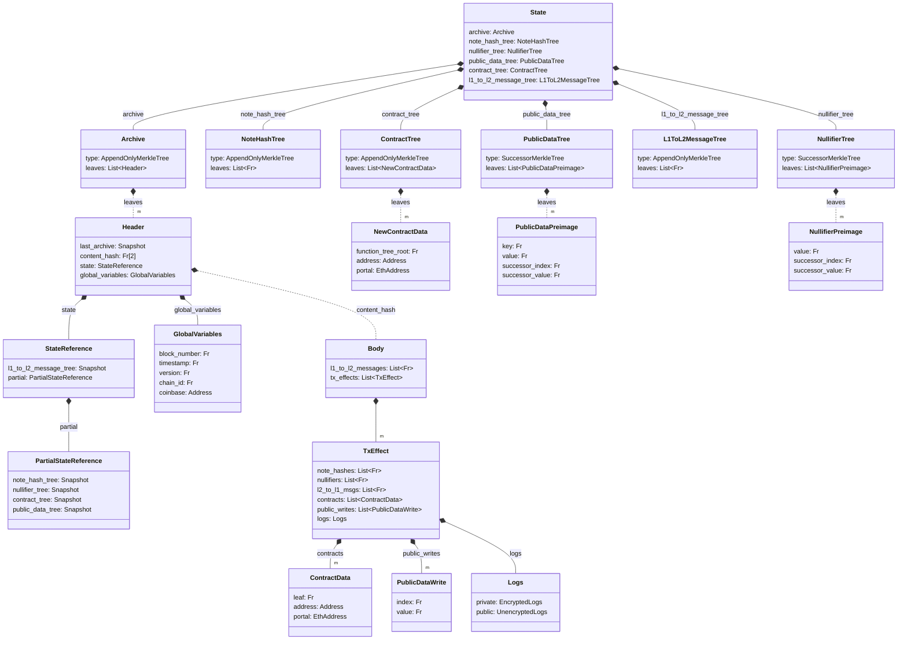

# State

Global state in the Aztec Network is represented by a set of Merkle trees: the [Note Hash tree](./note_hash_tree.md), [Nullifier tree](./nullifier_tree.md), and [Public Data tree](./public_data_tree.md) reflect the latest state of the chain, while the L1 to L2 message tree allows for [cross-chain communication](../contracts/#l2-outbox) and the [Archive](./archive.md) allows for historical state access.

Merkle trees are either 
- [append-only](./tree_impls.md#append-only-merkle-trees), for data where we only require inclusion proofs or 
- [indexed](./tree_impls.md#indexed-merkle-trees) for storing data that requires proofs of non-membership.

import DocCardList from '@theme/DocCardList';

<DocCardList />
